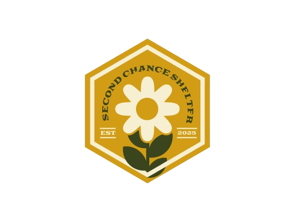

<div align="center">
  
</div>

# COSC 4353 Project

This project is a comprehensive web-based volunteer coordination and event management system built as part of the COSC 4353 course.

## Features

- **User Authentication**: Register, log in, and log out securely.
- **Admin Dashboard**: Manage users, events, and view reports.
- **Volunteer Coordination**: Match volunteers with upcoming events.
- **Event Management**: Create, update, and delete outreach events.
- **Notification System**: Send timely updates to volunteers.
- **Participation History**: Track volunteer involvement.
- **Profile Management**: View and update profile details.

## Technologies Used

- **Frontend**: HTML, CSS (Global Styles), JavaScript  
- **Backend**: PHP  
- **Database**: MySQL  
- **Styling**: Custom global.css for consistent UI design  

## How to Run Locally

1. Clone the repository:
   ```bash
   git clone https://github.com/yourusername/COSC-4353-Project.git
   ```
2. Navigate to the project directory:
   ```bash
   cd COSC-4353-Project
   ```
3. Start PHP's built-in server:
   ```bash
   php -S localhost:8000
   ```
4. Open your browser and go to:
   ```
   http://localhost:8000
   ```

## Team
- Henry Moran
- Santiago Segovia
- D’Metri Samuels
- William Stewart

---
